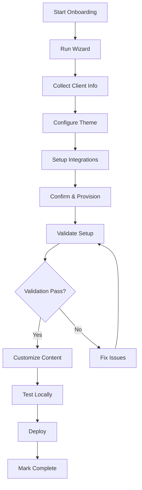

<!--
META: Automated Client Onboarding System
AUTHOR: Platform Team
CREATED: 2026-02-04
UPDATED: 2026-02-04
VERSION: 1.0.0
STATUS: Production
PURPOSE: Complete guide for automated client provisioning and onboarding
KEYWORDS: onboarding, automation, provisioning, clients, workflow
-->

# Automated Client Onboarding System

## Overview

The automated client onboarding system provides a complete workflow for rapidly provisioning new client sites with theme customization, configuration management, and progress tracking.

## Table of Contents

- [Features](#features)
- [Quick Start](#quick-start)
- [Tools](#tools)
- [Workflow](#workflow)
- [Configuration](#configuration)
- [Progress Tracking](#progress-tracking)
- [Best Practices](#best-practices)
- [Troubleshooting](#troubleshooting)

## Features

### ✨ Core Capabilities

1. **Interactive Wizard** - Step-by-step guided provisioning
2. **Automated Provisioning** - Script-based client site creation
3. **Theme Customization** - Brand colors and typography setup
4. **Configuration Management** - Environment and integration setup
5. **Progress Tracking** - Real-time onboarding status dashboard
6. **Validation** - Automated completeness checking
7. **Integration Setup** - Analytics and CRM configuration

### 🎯 Onboarding Checklist

The system tracks completion of these key items:

- ✅ Client directory structure
- ✅ Package configuration
- ✅ Theme configuration
- ✅ Environment setup
- ✅ Documentation
- ✅ Client config file
- ✅ Content customization
- ✅ Deployment configuration
- ✅ Testing setup

## Quick Start

### Interactive Wizard (Recommended)

```bash
# Run the interactive onboarding wizard
node scripts/onboarding/onboarding-wizard.js
```

The wizard will guide you through:
1. Client information (name, display name, website)
2. Theme configuration (colors, fonts)
3. Integration settings (Analytics, HubSpot)
4. Confirmation and provisioning
5. Post-setup tasks

### Script-Based Provisioning

```bash
# Basic provisioning
./scripts/onboarding/provision-client.sh acme-corp

# With custom theme colors
./scripts/onboarding/provision-client.sh acme-corp \
  --theme-primary "#FF5733" \
  --theme-secondary "#00AA66"

# Dry run (preview only)
./scripts/onboarding/provision-client.sh test-client --dry-run
```

### Validation

```bash
# Validate a provisioned client
./scripts/onboarding/validate-client.sh acme-corp
```

### Progress Tracking

```bash
# View all clients dashboard
node scripts/onboarding/track-progress.js

# View specific client progress
node scripts/onboarding/track-progress.js acme-corp
```

## Tools

### 1. Onboarding Wizard (`onboarding-wizard.js`)

**Purpose**: Interactive CLI wizard for complete client setup

**Features**:
- Step-by-step guided process
- Input validation
- Theme customization
- Integration configuration
- Configuration file generation
- Post-provisioning summary

**Usage**:
```bash
node scripts/onboarding/onboarding-wizard.js
```

**Output**:
- Provisioned client site in `apps/<client-name>/`
- Theme configuration in `packages/tokens/src/themes/<client-name>/`
- Client config file `apps/<client-name>/client.config.json`
- Environment template `.env.example`
- Documentation `README.md`

### 2. Provision Client Script (`provision-client.sh`)

**Purpose**: Automated script-based provisioning

**Options**:
- `--theme-primary` - Primary brand color (hex)
- `--theme-secondary` - Secondary brand color (hex)
- `--skip-git` - Skip git operations
- `--dry-run` - Preview without executing

**What It Does**:
1. Copies `template-site` to new client directory
2. Creates theme configuration
3. Updates package.json with client name
4. Creates environment configuration
5. Generates client documentation
6. Updates workspace configuration

### 3. Validate Client Script (`validate-client.sh`)

**Purpose**: Verify provisioning completeness

**Checks**:
- Client directory exists
- package.json configuration
- Theme configuration
- Environment files
- Documentation
- Next.js config
- TypeScript config
- App directory structure

**Exit Codes**:
- `0` - Validation passed
- `1` - Validation failed

### 4. Progress Tracker (`track-progress.js`)

**Purpose**: Monitor onboarding completion status

**Features**:
- Progress percentage calculation
- Weighted checklist items
- Visual progress bars
- Dashboard for all clients
- Detailed item status

**Usage**:
```bash
# Dashboard (all clients)
node scripts/onboarding/track-progress.js

# Specific client
node scripts/onboarding/track-progress.js acme-corp
```

## Workflow

### Standard Onboarding Process



### Step-by-Step Guide

#### Phase 1: Initial Provisioning (5-10 minutes)

1. **Run Wizard**
   ```bash
   node scripts/onboarding/onboarding-wizard.js
   ```

2. **Provide Information**
   - Client name (e.g., `acme-corp`)
   - Display name (e.g., "Acme Corporation")
   - Website URL (optional)
   - Brand colors (primary, secondary)
   - Font preferences
   - Integration settings

3. **Confirm and Provision**
   - Review summary
   - Confirm to execute
   - Wait for provisioning (30-60 seconds)

#### Phase 2: Validation (2-5 minutes)

1. **Run Validation**
   ```bash
   ./scripts/onboarding/validate-client.sh acme-corp
   ```

2. **Review Results**
   - Check for errors or warnings
   - Fix any identified issues

3. **Check Progress**
   ```bash
   node scripts/onboarding/track-progress.js acme-corp
   ```

#### Phase 3: Customization (30-60 minutes)

1. **Review Theme**
   ```typescript
   // packages/tokens/src/themes/acme-corp/index.ts
   export const acmeCorpTheme = {
     colors: {
       primary: '#FF5733',
       secondary: '#00AA66',
     },
     typography: {
       fontFamily: 'Inter, system-ui, sans-serif',
     },
   };
   ```

2. **Configure Environment**
   ```bash
   # Copy example to local
   cp apps/acme-corp/.env.example apps/acme-corp/.env.local
   
   # Edit with actual values
   vim apps/acme-corp/.env.local
   ```

3. **Customize Content**
   - Edit `apps/acme-corp/app/page.tsx`
   - Update images and assets
   - Modify sections and layout

#### Phase 4: Testing & Deployment (15-30 minutes)

1. **Local Testing**
   ```bash
   # Install dependencies
   pnpm install
   
   # Start dev server
   pnpm --filter @repo/acme-corp dev
   ```

2. **Run Tests**
   ```bash
   # Type checking
   pnpm --filter @repo/acme-corp type-check
   
   # Linting
   pnpm --filter @repo/acme-corp lint
   
   # Build test
   pnpm --filter @repo/acme-corp build
   ```

3. **Deploy**
   - Configure deployment (Vercel, Docker, etc.)
   - Push to production
   - Verify deployment

4. **Mark Complete**
   - Final progress check (should be 100%)
   - Document in client records

## Configuration

### Client Config File

Each client has a `client.config.json` file:

```json
{
  "name": "acme-corp",
  "displayName": "Acme Corporation",
  "website": "https://acme.com",
  "theme": {
    "primary": "#FF5733",
    "secondary": "#00AA66",
    "fontFamily": "Inter, system-ui, sans-serif"
  },
  "integrations": {
    "analytics": {
      "enabled": true,
      "gaId": "GA-XXXXXXXXX"
    },
    "hubspot": {
      "enabled": true,
      "portalId": "12345678",
      "formId": "abcd-1234"
    }
  },
  "provisioned": "2026-02-04T10:30:00.000Z"
}
```

### Environment Variables

Required environment variables in `.env.local`:

```bash
# Site Configuration
NEXT_PUBLIC_SITE_NAME="acme-corp"
NEXT_PUBLIC_SITE_URL="https://acme.example.com"

# Analytics
NEXT_PUBLIC_GA_ID="GA-XXXXXXXXX"
NEXT_PUBLIC_GTM_ID="GTM-XXXXXX"

# Integrations
NEXT_PUBLIC_HUBSPOT_PORTAL_ID="12345678"
NEXT_PUBLIC_HUBSPOT_FORM_ID="abcd-1234"

# API
NEXT_PUBLIC_API_URL="https://api.example.com"
```

## Progress Tracking

### Progress Calculation

Progress is calculated using weighted checklist items:

| Item | Weight | Description |
|------|--------|-------------|
| Directory | 10% | Client directory created |
| Package | 10% | package.json configured |
| Theme | 15% | Theme configuration complete |
| Environment | 10% | .env files present |
| Documentation | 10% | README.md created |
| Config | 15% | client.config.json present |
| Content | 15% | Custom content (not template) |
| Deployment | 10% | Deployment config present |
| Testing | 5% | Tests created and passing |

### Progress Dashboard

View all clients:
```bash
node scripts/onboarding/track-progress.js
```

Output:
```
==================================================
Client Onboarding Dashboard
==================================================

Total clients: 3

  acme-corp                    ████████████████████ 100%
  template-site                ████████████░░░░░░░░  60%
  your-dedicated-marketer      ████████████████░░░░  80%
```

### Individual Client Status

View specific client:
```bash
node scripts/onboarding/track-progress.js acme-corp
```

Output:
```
Client: acme-corp
──────────────────────────────────────────────────
Progress: ██████████████████████████████ 100%
Completed: 9/9 items

  ✓ Client directory created
  ✓ Package configuration
  ✓ Theme configuration
  ✓ Environment setup
  ✓ Documentation created
  ✓ Client config file
  ✓ Content customization
  ✓ Deployment configuration
  ✓ Testing completed

✓ Onboarding complete!
```

## Best Practices

### 1. Use the Wizard for New Clients

The interactive wizard ensures all required information is collected and properly formatted.

### 2. Validate Immediately After Provisioning

Run validation right after provisioning to catch any issues early:
```bash
./scripts/onboarding/validate-client.sh <client-name>
```

### 3. Track Progress Regularly

Check progress during customization phase to ensure all items are completed:
```bash
node scripts/onboarding/track-progress.js <client-name>
```

### 4. Follow Naming Conventions

- Use lowercase with hyphens: `acme-corp`
- Avoid special characters
- Keep names concise but descriptive

### 5. Complete All Checklist Items

Aim for 100% completion before going to production:
- All configuration files present
- Content customized (not template)
- Tests created and passing
- Deployment configured

### 6. Document Custom Requirements

If client has special requirements, document them in:
- `apps/<client-name>/README.md`
- `apps/<client-name>/CUSTOM.md` (if needed)

### 7. Test Locally Before Deploying

Always test the full build locally:
```bash
pnpm --filter @repo/<client-name> build
pnpm --filter @repo/<client-name> start
```

## Troubleshooting

### Issue: Provisioning Script Fails

**Symptoms**: Script exits with error

**Solutions**:
1. Check client name format (lowercase, hyphens only)
2. Verify template-site directory exists
3. Ensure no existing client with same name
4. Check file permissions

### Issue: Validation Fails

**Symptoms**: Validation script reports errors

**Solutions**:
1. Review specific error messages
2. Check file exists in expected locations
3. Verify package.json has correct name
4. Ensure theme file is valid TypeScript

### Issue: Progress Shows 0%

**Symptoms**: Progress tracker shows no completion

**Solutions**:
1. Verify client directory exists
2. Check provisioning completed successfully
3. Run validation to identify missing items
4. Review checklist items manually

### Issue: Theme Not Applied

**Symptoms**: Site doesn't use custom colors

**Solutions**:
1. Check theme file exists and exports correctly
2. Verify theme is imported in client app
3. Check CSS variables are applied
4. Restart dev server

### Issue: Environment Variables Not Working

**Symptoms**: Integrations not functioning

**Solutions**:
1. Verify `.env.local` exists (not just `.env.example`)
2. Check variable names match exactly
3. Restart dev server after changes
4. Verify variables start with `NEXT_PUBLIC_` for client-side

### Issue: Content Still Shows Template

**Symptoms**: Progress shows content not customized

**Solutions**:
1. Edit `apps/<client-name>/app/page.tsx`
2. Remove template placeholders like `[Your Company]`
3. Replace with actual client content
4. Update images and assets

## Advanced Usage

### Batch Provisioning

Create multiple clients from a CSV:

```bash
# Format: name,display,primary,secondary
cat clients.csv | while IFS=, read name display primary secondary; do
  ./scripts/onboarding/provision-client.sh "$name" \
    --theme-primary "$primary" \
    --theme-secondary "$secondary"
done
```

### Custom Post-Provisioning

Add custom logic after provisioning:

```bash
# provision-and-setup.sh
./scripts/onboarding/provision-client.sh "$1"
./scripts/onboarding/validate-client.sh "$1"

# Custom setup
cd "apps/$1"
pnpm install
pnpm build
```

### Progress Monitoring Integration

Export progress data for monitoring:

```javascript
// In track-progress.js
const progress = calculateProgress(clientName);
console.log(JSON.stringify({
  client: clientName,
  percentage: progress.percentage,
  timestamp: new Date().toISOString(),
}));
```

## API Reference

### Onboarding Wizard

```javascript
// onboarding-wizard.js
runWizard()
  .then(() => console.log('Success'))
  .catch(err => console.error(err));
```

### Progress Tracker

```javascript
// track-progress.js
const progress = calculateProgress('acme-corp');
console.log(progress.percentage); // 85
console.log(progress.completedItems); // 7
console.log(progress.totalItems); // 9
```

## Resources

### Documentation
- [Client Provisioning Guide](./CLIENT_PROVISIONING.md)
- [Theme Customization](../design/THEMING.md)
- [Environment Configuration](../CONTRIBUTING.md)

### Scripts
- `scripts/onboarding/onboarding-wizard.js`
- `scripts/onboarding/provision-client.sh`
- `scripts/onboarding/validate-client.sh`
- `scripts/onboarding/track-progress.js`

### Templates
- `apps/template-site/` - Base template for all clients

---

**Last Updated**: 2026-02-04  
**Version**: 1.0.0  
**Maintainer**: Platform Team
